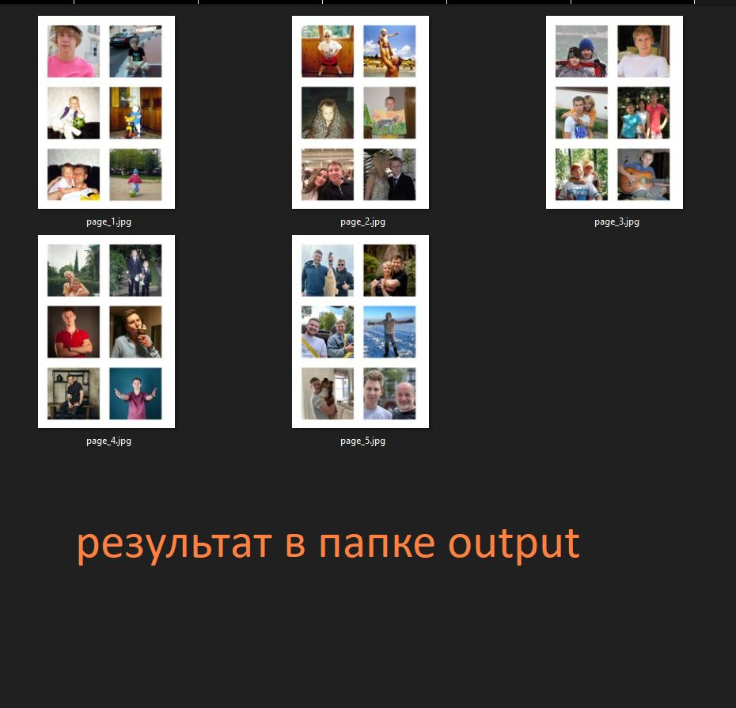

# images_to_polaroid
# Размещение фотографий на листах A4 для нарезки в стиле Polaroid
Описание

Этот скрипт автоматически размещает квадратные фотографии на листах формата A4 с отступами которые устанавливаются юзером в коде. Каждая страница содержит 6 фотографий размером 8×8 см (80×80 мм). Готовые страницы сохраняются в папке output.
Изначально все фото должны быть кадрированы в соотношении 1:1.
# Примеры


Программа автоматически создаёт новые листы А4 с фиксированным количеством фото (6 штук)
# Структура файлов
```
project_root
├──  photos        # Исходные фотографии (jpg, png)
│   ├── image1.jpg  
│   ├── image2.JPG  
│   └── ...
├──  output        # Сохраненные листы A4 с фотографиями
│   ├── page_1.jpg  
│   ├── page_2.jpg  
│   └── ...
├── script.py        # Основной скрипт
```

# Дополнительно
-Скрипт автоматически обрабатывает файлы с любым регистром расширений (.jpg, .JPG, .png, .PNG).

-Изображения масштабируются до 80×80 мм при разрешении 300 DPI.

-Если фотографий меньше 6 на последней странице, пустые места остаются белыми.

